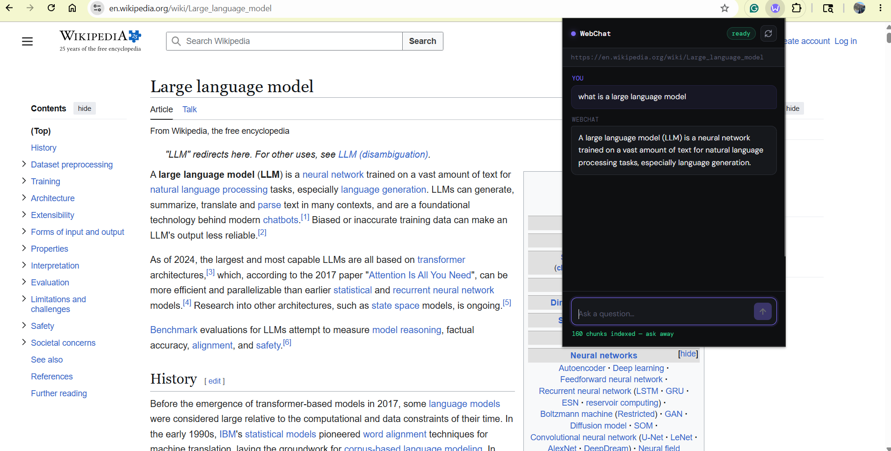
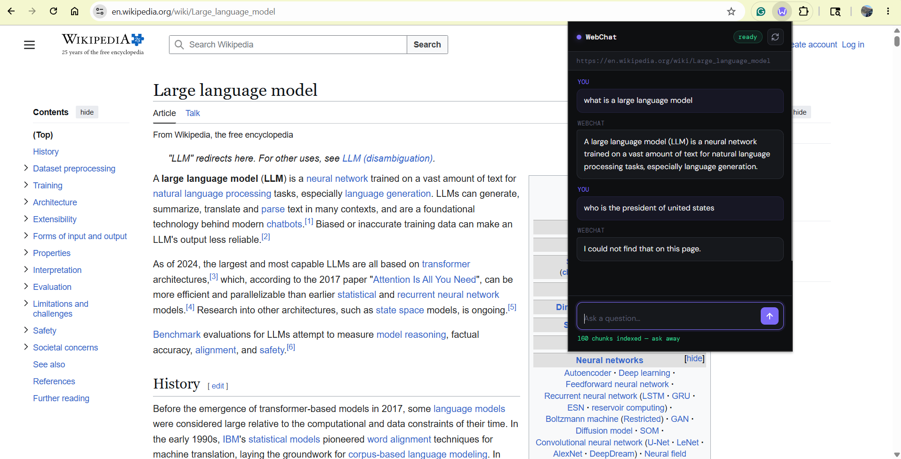

<div align="center">
  
# WebChat

**Chat with any webpage — directly in your browser.**

Ask questions, get summaries, find information — all grounded in the page you're reading.

[](https://www.python.org/)
[](https://fastapi.tiangolo.com/)
[](https://developer.chrome.com/docs/extensions/mv3/)
[](https://groq.com/)
[](https://render.com/)
[](LICENSE)

[Features](#-key-features) · [Architecture](#-architecture) · [Quick Start](#-local-development) · [Deploy](#-deployment) · [Limitations](#-limitations)

</div>

---

## What is WebChat?

When reading documentation, Wikipedia, or long technical articles, finding specific information means scrolling, Ctrl+F, or copy-pasting into a chatbot. **WebChat eliminates all of that.**

It's a Chrome extension that lets you ask natural language questions about the page you're currently reading — with answers grounded in that page's actual content.

```
"What does this page say about X?"        →  Instant, cited answer
"Summarize the key points in 3 bullets."  →  Done
"Where does it mention Z?"                →  Found
"Who is the president of the US?"         →  "I could not find that on this page."
```

---

## ✨ Key Features

| Feature | Description |
|---|---|
| 🗂️ **RAG-powered answers** | Retrieves only the most relevant chunks before answering — no hallucinations from unrelated content |
| 🔍 **BM25 retrieval** | Lightweight, fast, and memory-efficient — no ML runtimes needed |
| ⚡ **Streaming responses** | Tokens stream in real-time via SSE — feels instant |
| 🧠 **"Not on this page" behavior** | Explicitly refuses to answer questions the page doesn't cover |
| 🔄 **Rescan button** | Re-indexes updated pages or recovers from blocked/empty scrapes |
| 🪶 **Free-tier ready** | Designed to run on Render's 512MB free tier |
| 🔒 **Privacy-conscious** | Only page chunks + your question go to the LLM — no full page uploads |

---

## 🏗️ Architecture

```
┌─────────────────────────────────┐
│      Chrome Extension (UI)       │
│   popup.html  ·  popup.js        │
│   background.js  ·  content.js   │
└───────────────┬─────────────────┘
                │
        POST /scrape (URL)
        POST /chat/stream (session_id + question)
                │
                ▼
┌─────────────────────────────────┐
│        FastAPI Backend           │
│                                  │
│  /scrape  →  fetch + chunk       │
│              + store in session  │
│                                  │
│  /chat    →  BM25 retrieve       │
│              + Groq answer       │
│                                  │
│  /chat/stream  →  SSE tokens     │
└───────────────┬─────────────────┘
                │
                ▼
┌─────────────────────────────────┐
│            Groq LLM              │
│      llama-3.1-8b-instant        │
└─────────────────────────────────┘
```

### Request Flows

<details>
<summary><strong>📥 Scrape / Index Flow</strong></summary>

1. User opens the extension popup on any page
2. Extension sends `POST /scrape` with the current tab's URL
3. Backend fetches the page, extracts meaningful content (`article`, `main`, `p`, headers, list items), normalizes whitespace, splits into chunks, and stores them under a `session_id`
4. Returns `{ session_id, page_title, chunks_stored }`
5. Extension caches `session_id` per tab via the background script

</details>

<details>
<summary><strong>💬 Chat Flow (Streaming)</strong></summary>

1. Extension sends `POST /chat/stream` with `{ session_id, question }`
2. Backend retrieves top-k relevant chunks using BM25
3. Builds a grounded context prompt and calls Groq
4. Streams tokens as SSE events:
   - `data: {"type":"token","text":"..."}`
   - `data: [DONE]`
5. Extension renders tokens live into the chat bubble

</details>

---

## Flow Chart

```text
User opens extension
        |
        v
 Is page already indexed for this tab?
     /      \
   yes       no
    |         |
    v         v
 Enable chat  POST /scrape (URL)
    |         |
    |         v
    |   Backend loads page
    |   -> clean text
    |   -> chunk text
    |   -> store chunks in session
    |         |
    |         v
    |   Return session_id + title
    |         |
    v         v
User asks question (chat)
        |
        v
POST /chat/stream (session_id + question)
        |
        v
BM25 retrieve top-k chunks
        |
        v
Groq LLM generates answer (stream tokens)
        |
        v
Extension renders tokens live
```

---

## Screenshots

Example:


### Working: Definition question


### Correct behavior: out-of-scope question


---

## 🛠️ Tech Stack

**Backend**
- [FastAPI](https://fastapi.tiangolo.com/) — async Python web framework
- [LangChain](https://www.langchain.com/) — prompt management + Groq integration
- [Groq](https://groq.com/) — LLM inference (`llama-3.1-8b-instant`)
- [BeautifulSoup4](https://www.crummy.com/software/BeautifulSoup/) + lxml — HTML parsing
- [rank-bm25](https://github.com/dorianbrown/rank_bm25) — BM25 retrieval

**Frontend**
- Chrome Extension Manifest v3
- Vanilla JavaScript, HTML, CSS
- SSE via `fetch()` + `ReadableStream`

**Infrastructure**
- [Render](https://render.com/) — backend hosting (free-tier compatible)

---

## 💡 Why BM25 Instead of Embeddings?

This is a deliberate design choice, not a shortcut.

Local embedding stacks (PyTorch / Transformers / FAISS / ONNX) introduce:
- Large dependency footprints (often 500MB+)
- High peak RAM usage that causes OOM crashes on startup
- Unpredictable memory spikes during inference

**BM25 gives us:**
- ✅ Very low memory overhead
- ✅ No ML runtime dependencies
- ✅ Fast, predictable CPU-based retrieval
- ✅ Reliable operation on Render's 512MB free tier

**Trade-off:** BM25 is keyword-driven, so broad semantic queries ("brief history of...") may retrieve less optimal context than embeddings would. This is mitigated by careful chunking and prompt grounding, with hybrid retrieval planned for future higher-memory deployments.

---

## 🚀 Local Development

### 1. Backend

```bash
cd backend

# Create and activate virtual environment
python -m venv .venv
source .venv/bin/activate        # macOS/Linux
# .venv\Scripts\activate         # Windows

pip install -r requirements.txt
```

Create `backend/.env`:

```env
GROQ_API_KEY=your_groq_api_key_here
```

Start the server:

```bash
uvicorn app.main:app --reload
# Runs at http://127.0.0.1:8000
```

### 2. Chrome Extension

1. Open Chrome and go to `chrome://extensions/`
2. Enable **Developer mode** (top right toggle)
3. Click **Load unpacked** and select the `extension/` folder
4. The WebChat icon will appear in your toolbar

> **Note:** Update `API_BASE_URL` in `popup.js` to point to your local backend (`http://127.0.0.1:8000`) during development.

---

## ☁️ Deployment

Deploy the backend to [Render](https://render.com/) in a few steps:

| Setting | Value |
|---|---|
| **Build command** | `pip install -r backend/requirements.txt` |
| **Start command** | `uvicorn app.main:app --host 0.0.0.0 --port 10000` |
| **Environment variable** | `GROQ_API_KEY=your_key` |

A `render.yaml` is included in the repo for one-click configuration.

After deployment, update `API_BASE_URL` in the extension to your Render service URL and reload the unpacked extension.

---

## 📁 Project Structure

```
webchat/
├── backend/
│   ├── app/
│   │   ├── main.py          # FastAPI routes (/scrape, /chat, /chat/stream)
│   │   ├── scraper.py       # Web loading, chunking, session store
│   │   ├── chat.py          # BM25 retrieval + Groq answering
│   │   └── store.py         # TTL/LRU in-memory session store
│   ├── eval/
│   │   └── run_eval.py      # Evaluation runner
│   ├── requirements.txt
│   ├── runtime.txt
│   └── render.yaml
└── extension/
    ├── manifest.json
    ├── popup.html
    ├── popup.css
    ├── popup.js
    ├── background.js
    ├── content.js
    └── icons/
```

## Evaluation (Baseline)

This repo includes a lightweight evaluation script that scrapes a fixed set of pages, asks 30 questions (10 URLs × 3 questions), and scores answers using simple normalized substring checks.

### Run it

1) Start the backend (locally or use the deployed API URL).
2) Run:

```bash
cd backend
python eval/run_eval.py
```

> Note: `backend/eval/run_eval.py` uses `API_BASE` at the top of the file. Point it to your local server (`http://127.0.0.1:8000`) or the deployed Render URL.

### Latest results

- Questions: **30**
- Score: **28/30 passed (93.3%)**
- Breakdown: `not_found=1`, `mismatch=1`

<details>
<summary>Sample output (click to expand)</summary>

```text
RESULT: 28/30 passed (93.3%)
Breakdown: not_found=1, mismatch=1

Failed questions:
- [not_found] https://en.wikipedia.org/wiki/Chrome_extension :: Name one capability of browser extensions.
- [mismatch] https://en.wikipedia.org/wiki/Information_retrieval :: Name one common IR concept.
```

</details>

### What this eval measures (and what it doesn't)

- ✅ Quick regression check for end-to-end scraping + retrieval + answering
- ✅ Designed to be cheap and deterministic (no LLM-judge)
- ⚠️ Heuristic scoring: answers can be correct but fail if they use different wording (paraphrases)

## ⚠️ Limitations

- **JS-rendered pages** (React/Vue SPAs) may return limited content when scraped via `requests`. Playwright support is planned.
- **Broad semantic queries** (e.g. "brief history") may get suboptimal BM25 retrieval — try more specific phrasing, or use the Rescan button if content seems stale.
- **In-memory sessions** are lost on server restart. Redis/SQLite persistence is on the roadmap.

---

## 🔭 Roadmap

- [ ] **Query expansion** — improve BM25 retrieval for broad/semantic queries
- [ ] **Playwright support** — scrape JS-rendered SPAs
- [ ] **Persistent sessions** — Redis / SQLite backend
- [ ] **Hybrid retrieval** — BM25 + embeddings on higher-memory deployments
- [ ] **Source attribution** — "Show sources" toggle with retrieved passage highlights
- [ ] **Eval benchmark** — 30-question set with automatic scoring and accuracy badge

---

## 🔒 Security & Privacy

- WebChat sends only **retrieved text chunks** (not the full page) + your question to the LLM
- Avoid using on pages with sensitive or private information
- For production hardening: restrict CORS origins, add rate limiting, add authentication, use server-side session storage

---

## 📄 License

[MIT](LICENSE) — free to use, modify, and distribute.

---

<div align="center">
Built with FastAPI · Groq · BM25 · Chrome Extension MV3
</div>
